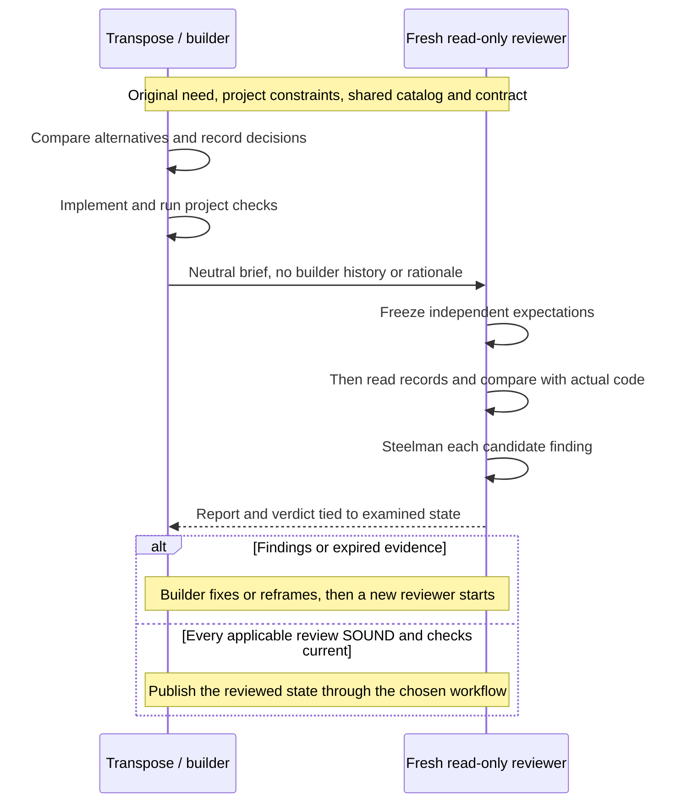

# Skills

Personal agent skills by **Guillaume Mongin** ([@hellraisercenobit](https://github.com/hellraisercenobit)). Licensed under [MIT](./LICENSE); ownership is recorded in [NOTICE](./NOTICE).

The **transpose/review suite** gives coding agents a repeatable way to make, implement and challenge engineering decisions. It combines domain rules with decisions recorded before code, project checks and an independent review of the final result. The aim is higher, more consistent quality through an inspectable process.

**Start here:** [strategy](#how-the-suite-works) · [value beyond rules](#what-this-adds-to-project-rules) · [scaling](#how-the-suite-scales) · [installation](#1-install-the-suite) · [project configuration](#2-configure-the-target-project) · [hooks and delivery](#4-integrate-with-a-delivery-pipeline).

The suite currently has three **dimensions**, each with a companion pair. Its six skills are **model-invoked** and can also be selected by the user:

| Dimension | Before implementation | Independent review |
| --- | --- | --- |
| Design patterns | [transpose-design-patterns](./skills/engineering/transpose-design-patterns/SKILL.md) | [review-design-patterns](./skills/engineering/review-design-patterns/SKILL.md) |
| Modern TS/JS | [transpose-modern-typescript](./skills/engineering/transpose-modern-typescript/SKILL.md) | [review-modern-typescript](./skills/engineering/review-modern-typescript/SKILL.md) |
| Testing / TDD | [transpose-testing-patterns](./skills/engineering/transpose-testing-patterns/SKILL.md) | [review-testing-patterns](./skills/engineering/review-testing-patterns/SKILL.md) |

`nuke-review`, `transpose-comments` and `review-comments` are **separate tools, outside this suite**. The whole plugin also installs them; that does not make them suite members or prerequisites.

## How the suite works

Each dimension answers a different question. Design patterns asks which architecture fits the forces and framework. Modern TypeScript asks which language, type-system, collection and platform choices fit the behavior and deployment targets. Testing patterns asks which observations, test forms and evidence protect the behavior, including static TypeScript guarantees. All three follow the same [versioned contract, C01-C12](./contracts/suite-contract.md).

**Transpose** turns the original need into an explicit choice: inventory the relevant sites, compare alternatives, record the decision before the first affected edit, implement and run checks. Keeping existing code or choosing no specialized pattern can be correct. Modernity alone is not a reason to rewrite.

**Review** starts in a fresh, read-only context. It receives the original request and factual constraints, without the builder's conversation or justification. It derives and freezes its own expected choices **before opening the decision records**, then compares **expected / recorded / actual**. For every suspected defect, it constructs the strongest legitimate defense, called a *steelman*. Only findings that survive that defense affect the verdict.



The builder makes corrections; the reviewer edits nothing. Each correction requires a new independent review. Missing prerequisites leave execution incomplete; unresolved disputes go to the user. A change to covered code, records, schemas or references expires affected verdicts. A shared-file edit expires every review covering that file. Publication uses the exact state the final reports identify.

For example, consider replacing a grouping helper with a native API. A rule can say "prefer native APIs". The pair must also establish the supported browsers, key semantics and public behavior, compare the native API with `Map`, a library or the existing helper, and record why the chosen option fits. Project checks exercise behavior; the fresh reviewer challenges the choice independently. An unsupported API or changed key semantics can fail review even with a persuasive decision record. Keeping the helper is valid when its defense holds. Performance claims need evidence.

For testing, a shipping threshold can justify direct examples without a builder or mock.
Testing records the public seam and independent expected charges before writing, observes
RED/GREEN and runs the compiler separately. Its reviewer checks whether a wrong boundary
would be detected. Creating a port activates design only if there is a real architectural
force; a local test does not require three records. The first runner adapter is Vitest.

## What this adds to project rules

Project rules remain useful for persistent conventions. The suite adds a procedure, explicit evidence and completion criteria around decisions that need judgment. Its advantage comes from following that protocol, not from naming an instruction file a "skill".

| With a rule alone | What the suite adds | Why it matters |
| --- | --- | --- |
| "Use appropriate patterns / modern idioms" | Scoped inventory, alternatives, trade-offs and observable invariants | Makes applicability explicit, including retained code and justified exclusions |
| "Explain the implementation" | A decision record created **before** the affected edit, with revisions preserved | Makes a later change of reasoning visible instead of reconstructing intent afterwards |
| "Review your work" | A fresh reviewer freezes expectations before reading the builder's decisions | Reduces anchoring on the author's explanation |
| "Follow these guidelines" | One catalog shared by the pair; each confirmed finding needs a rule, evidence and a refuted defense | Constrains taste-based rewrites and unsupported objections |
| "The tests pass" | Deterministic checks **and** separate semantic judgment | Tests establish observed behavior; review challenges design and implementation choices |
| "Approved" | A verdict tied to scope, source state and reference versions | Prevents reusing an old approval as evidence for changed code |

The completion rule is **passing applicable checks AND current `SOUND` in every applicable dimension, with no unresolved dispute**. `SOUND` means a complete audit with zero confirmed findings. `SMELLS` and `VIOLATIONS` are findings to resolve; missing prerequisites are incomplete execution. A dimension with no applicable site is recorded as non-applicable, not awarded a synthetic `SOUND`.

These are **protocol requirements**, not an automatic guarantee of bug-free code. Reviewers can miss defects, share model blind spots or work from incomplete catalogs. The repository's [smoke fixtures](./tests/README.md) exercise representative behaviors; they do not establish a measured quality gain over rules alone. The process is designed to reduce omissions, unsupported decisions and stale approvals while making its limits visible.

Enforcement is `ai-engineering-gate`. The plugin ships it; the npm package is a byte-identical distribution root. A repository opts in with `.ai-engineering-suite.json` at the root. Without that marker the gate prints nothing and allows. The exit code of `can-stop` is the publication lock; generic CI success is not a suite verdict.

## How the suite scales

The unit of extension is a **dimension with two companions**, sharing a domain catalog and conforming to the same contract. Adding a dimension should not require copying the whole workflow into every existing skill.

- **Shared procedure, domain-owned rules.** The canonical contract owns independence, evidence, verdicts and expiry. Each transpose owns its catalog, schema and guides; its review reads those same references. Generated contract bundles make installed pairs portable without maintaining separate protocol copies by hand.
- **Load the relevant expertise.** Select only dimensions and guides applicable to the task. A local TS idiom does not automatically require an architectural decision. Splitting domains and reviewer contexts limits unrelated material in each review.
- **Compose reviews on one state.** One builder coordinates decisions. Final reviewers can run in parallel on the same frozen source state, with separate reports and no exchange of rationale. Parallelism shortens the review path; it does not remove the cost of each review.
- **Combine requirements, not scores.** A design `SOUND` cannot compensate for a TypeScript `VIOLATIONS`. Conflicting invariants reopen the decisions; recurring conflicts require user arbitration. After a shared-file edit, repeat every affected review. Without precise scope tracking, repeat all reviews for the change.
- **Qualify every new pair.** A matching name is insufficient. Exercise a complete fixture flow: prior decision, implementation, checks, independent review, detected defect, correction and fresh review. Include justified retention, missing companions and cross-dimension expiry. Declare supported contract versions and verify real gate support separately.

This scales maintenance through shared contracts and focused catalogs, and execution through scoped decisions and independent reviewers. It deliberately adds review work where a dimension applies. It does not depend on one enormous prompt or an ever-growing global rule list. The [maintainer guide](./docs/skill-suite.md#maintain-and-extend) explains registration and qualification.

## Where to read next

This README owns the human entry point: strategy, installation, project policy, hooks and delivery. The other pages have narrower responsibilities:

| Document | Purpose |
| --- | --- |
| [Shared contract](./contracts/suite-contract.md) | Authoritative C01-C12 requirements, neutral reviewer brief and expiry rules |
| [Suite maintainer guide](./docs/skill-suite.md) | Composition details, ownership and qualification of new dimensions |
| [Engineering skill pages](./docs/engineering/README.md) | Each tool's purpose, triggers and domain-specific usage |
| Each `transpose-*/references/` bundle | Authoritative domain catalog, decision schema and applicable guides |
| [Smoke validation](./tests/README.md) | Reproduce deterministic checks and behavioral evaluations; understand their limits |
| [Glossary](./CONTEXT.md) | Definitions of marker, declaration, fingerprint, envelope, gate, verdict and attestation |
| [Gate](./docs/ai-engineering-gate.md) | Commands, fingerprints, hooks and the AXI self-assessment |

## 1. Install the suite

You need Git, Node.js/npm and a configured coding agent. Use Node 24 for this repository's own checks. The skills follow the target project's compiler and runtime; they do not require a TypeScript upgrade.

Choose one method. Always install both companions of a dimension from the same revision.

### Project installation with skills.sh

From the root of the project where you want to use the skills:

```sh
npx skills add hellraisercenobit/skills \
  --skill transpose-design-patterns review-design-patterns transpose-modern-typescript review-modern-typescript \
  transpose-testing-patterns review-testing-patterns \
  --agent codex claude-code --yes
npx skills list
```

Keep only the agent names you use. Add `--global` for a personal installation shared by projects, then verify with `npx skills list --global`. The [skills CLI](https://github.com/vercel-labs/skills#options) supports both scopes. This installs the six suite skills, without the optional named reviewer agents.

For a team, keep the project skill files, relative links and `skills-lock.json` produced by the installer under version control; verify from a fresh checkout. To pin the source, clone this repository, check out the chosen tag or commit, then use that local checkout path instead of `hellraisercenobit/skills` above. Record `npx skills --version` too. Avoid absolute links into another developer's home directory.

### Claude Code plugin

This installs all promoted skills and the `design-pattern-reviewer`, `modern-typescript-reviewer` and `testing-pattern-reviewer` agents:

```sh
claude plugin marketplace add hellraisercenobit/skills
claude plugin install hellraisercenobit-skills@hellraisercenobit
claude plugin list
```

Restart Claude Code afterwards. Use the installed name shown by the harness; plugin skills can have a `hellraisercenobit-skills:` prefix. Avoid installing a second copy through skills.sh for the same harness and scope.

### Local development from this repository

```sh
git clone https://github.com/hellraisercenobit/skills.git agent-skills
cd agent-skills
npm ci
npm test
npm run check:contract
npm run link-skills
```

`link-skills` links all non-deprecated skills into `~/.claude/skills` and `~/.agents/skills`, and reviewers into `~/.claude/agents`. It reflects this checkout, including uncommitted edits. **Back up same-named personal skill directories first: the script replaces them.** Existing real agent files are skipped. Use a pinned checkout when reproducibility matters.

### Verify discovery

Start a new session in your target project and ask:

```text
Without editing files, resolve transpose-design-patterns, review-design-patterns,
transpose-modern-typescript, review-modern-typescript, transpose-testing-patterns
and review-testing-patterns. List their installed
paths, shared contract version and catalogs/schemas. Confirm that you can start
a fresh reviewer without inheriting this conversation.
```

Expected: six skills, accessible companion references and shared contract `1.0.0`. Missing companions or independent context must be reported. Codex supports project `.agents/skills` and user `~/.agents/skills`, including symlinks; use `/skills` or `$` to select a skill. See [OpenAI's skill documentation](https://learn.chatgpt.com/docs/build-skills).

## 2. Configure the target project

Add this policy to the existing project `AGENTS.md`, preserving its other rules. For another harness, use its project instructions; for Claude Code, ensure `CLAUDE.md` loads the policy. [Codex reads AGENTS.md](https://learn.chatgpt.com/docs/agent-configuration/agents-md) when a session starts.

```markdown
## Transpose/review suite

- Identify scope/base, actual compiler/runtime targets and applicable dimensions.
  Use transpose-design-patterns for architectural forces and
  transpose-modern-typescript for TS/JS implementation choices, and
  transpose-testing-patterns for test strategy and TDD evidence.
- Resolve both companions and their shared contract. Record and validate decisions
  outside the repository before the first affected implementation write.
- Run project checks. Give each applicable review skill to a fresh read-only
  reviewer with no builder history. Use the shared contract's neutral brief:
  raw request, scope/base, factual constraints, record paths and check evidence.
- The reviewer freezes expectations before opening records. The builder fixes;
  a new reviewer checks. Keep reviewer reports separate from builder rationale.
- Finish only with passing checks and current SOUND in every applicable dimension.
  Changes to covered files or references expire affected verdicts. A dimension
  without an applicable site is non-applicable, with a reason.
- nuke-review, transpose-comments and review-comments are separate tools and
  cannot supply or replace a suite verdict.
```

Also document the project's actual typecheck, test, lint/build commands and runtime/browser targets. Use its existing scripts and support policy, not this repository's test compiler as an application requirement.

Choose a persistent evidence directory outside the Git checkout, with a subdirectory per task. Builder and reviewers must be able to access it, including from pipeline worktrees. Keep records, revisions, check results and reports there. A valid schema proves record shape, not decision quality. Each transpose skill supplies its validation instructions.

## 3. Run a first task

Give the builder a concrete need and public constraints:

```text
Modernize src/catalog.ts while preserving its public behavior. Use the installed
transpose-modern-typescript skill and the project's actual deployment targets.
Consider design-pattern transposition only if architectural forces apply.
Use an external evidence directory, run project checks and obtain the required
fresh independent reviews before reporting completion.
```

For a first testing task, use:

```text
Implement the shipping threshold described in the ticket using Vitest. Use
transpose-testing-patterns, record the seam and oracle before writing, retain
actual RED/GREEN outputs and inspectable states outside the repository, run
runtime and TypeScript checks, then obtain a fresh review-testing-patterns review.
```

The evidence must identify the required scenarios and tests actually executed, including
skips, expected failures and retries. A global green result is insufficient. See the
[Vitest qualification guide](./tests/testing-patterns/README.md) for reproducible examples.

The suite skills support implicit invocation; a named request makes the first run easier to inspect. When a named reviewer agent is unavailable, use a fresh general subagent or separate session with the same neutral brief. Reusing the builder's conversation does not provide independence.

Expect decisions, checks, a frozen review matrix, comparison and verdict. `SOUND` means zero confirmed findings after a complete audit. `SMELLS` and `VIOLATIONS` require correction or explicit resolution; missing prerequisites leave execution incomplete. Retaining an existing implementation can be the right decision.

The [suite guide](./docs/skill-suite.md) explains composition, fingerprints and extension. The [shared contract](./contracts/suite-contract.md) owns the full protocol.

## 4. Integrate with a delivery pipeline

Two routes, one gate. The commands, hooks and evidence are identical whether a delivery pipeline exists or not; only who dispatches the reviews and what consumes the exit code differ. `can-stop` is the lock. `--full` is the payload under no-mistakes. `--json` is the payload under CI.

Commit `.ai-engineering-suite.json` at the project root to opt in. See [the gate page](./docs/ai-engineering-gate.md) for the marker shape and the command set.

### Connect Claude Code and Codex hooks

The Claude Code plugin installs the gate and three hooks in one step: `SessionStart` injects the compact status, `PreToolUse` asks `can-write` on edit and shell tools and `can-review` on reviewer dispatches, `Stop` asks `can-stop`. SubagentStop is optional and never decides validity.

A skills.sh copy and Codex are not covered by the plugin. From a checkout of this repository:

```sh
npm run install:hooks
```

That installer writes only the suite's own entries, so running it twice changes nothing and removing it leaves every other hook intact. Codex is claimed in Codex's own vocabulary (`preToolUse`, `beforeShellExecution`, `subagentStart`, `stop`). Nothing injects context at Codex `sessionStart`; the installer reports that limit instead of wiring a hook that answers into the void.

Smoke-test before a real task: `ai-engineering-gate status` in a marked repository prints one row per dimension; the same command in an unmarked repository prints nothing. Restart the harness, open a fresh session, and confirm the compact status is in context. Keep independent reviewers outside the builder's context; a hook cannot establish that independence by itself. Stop is advisory in both harnesses; the lock is the exit code a pipeline or CI consumes.

| Event | What the gate answers |
| --- | --- |
| `SessionStart` | Compact status plus the gate command line |
| `PreToolUse` | `can-write` / `can-review`; a denial is `permissionDecision: deny` |
| `Stop` | `can-stop`; incomplete work becomes a block or a follow-up message |

See [Claude events](https://code.claude.com/docs/en/hooks#pretooluse) and [Codex tool coverage](https://learn.chatgpt.com/docs/hooks#tool-coverage).

### With no-mistakes

1. Install and authenticate [no-mistakes and a supported agent](https://kunchenguid.github.io/no-mistakes/start-here/installation/). Install the suite for that same agent and operating-system user, so the plugin loads inside pipeline agents too.
2. Initialize once inside the target Git repository: `no-mistakes init` then `no-mistakes doctor`.
3. Merge the [repository config this project ships](./.no-mistakes.yaml) into `.no-mistakes.yaml`. It declares a repository gate after `lint` whose command is `ai-engineering-gate can-stop --full`, makes the review agent the dispatcher, revalidates CI repairs through the local gates, and protects the marker and the export directory from automatic commits. Those fields take effect from the **trusted default branch**. Until they land there, dispatch the reviewers by hand from `status --full`.
4. Implement through transpose, commit on a feature branch, then hand a **fresh driver session** the original request. Driver context is not the neutral brief. The driver starts `no-mistakes axi run --intent "..."`.
5. The driver never answers the suite gate and never writes an arbitration. Completions codes route as follows:

| Codes | Driver action |
| --- | --- |
| `stale-source`, `stale-reference`, `stale-decision`, `missing-review`, `remedies-pending` | `--action fix` so the repair agent executes the printed plan |
| `arbitration-required`, `round-cap-reached`, `unresolved-dispute` | park and quote the exact `arbitrate` command for the user to run locally |
| `missing-declaration`, `missing-reason`, `missing-record`, `missing-evidence`, `non-sound-review`, `review-in-flight` | park with the list; that work belongs to the author |
| `gate-failure` | park as infrastructure |

Do not launch `axi run` from a harness hook: pipeline agents trigger those events too. Approving or skipping the suite gate belongs to the user alone.

### Direct GitHub PR, without no-mistakes

The same hooks and the same dispatcher, locally. For publication, `ai-engineering-gate export` copies the task's documents into the marker's `exportDirectory`. It refuses a dirty worktree, so a clean checkout will recompute the same fingerprints. Commit the export with the change. CI runs `can-stop --from-export` from a clean checkout: the source fingerprint from the merge-base, the reference fingerprint from the gate bundle CI installs, the decision fingerprint from the exported records. The check fails when the marker exists on the base ref and not on the head. Make that check required on the target branch.

```sh
ai-engineering-gate export
git add .engineering-suite
git commit -m "chore: export suite evidence"
git push -u origin HEAD
gh pr create --base main --fill
gh pr checks --watch
```

Replace `main` with the actual PR target. An empty check list is not a pass. Local hooks can be bypassed; the required CI check is the lock on this route.

## Updates and troubleshooting

### Migrate the design-pattern skill name

`transpose-design-patterns` replaces `transpose-design-pattern`. There is no alias. For an existing skills.sh installation, install the six companions with the new names using step 1, then remove the old entry in the same scope:

```sh
npx skills remove transpose-design-pattern --yes
npx skills list
```

Add `--global` to both commands for a personal install. Back up local edits before removing an installed copy. For a plugin installation, update the plugin and restart. For local development links, run `npm run link-skills`, inspect the old singular link in `~/.agents/skills` and `~/.claude/skills`, then unlink only that obsolete link; the script does not remove renamed entries.

Replace the old invocation in your project's `AGENTS.md`, `CLAUDE.md`, pipeline prompts and saved commands. Verify that discovery finds only the plural name and that the reviewer resolves its catalog and schema. Keep historical decision records unchanged; obtain fresh reviews against the renamed bundle.

### Update installed companions

Update the six companions together in the chosen scope:

```sh
npx skills update transpose-design-patterns review-design-patterns transpose-modern-typescript review-modern-typescript transpose-testing-patterns review-testing-patterns --project --yes
```

Use `--global` instead of `--project` for personal installs. For the plugin, run `claude plugin update hellraisercenobit-skills@hellraisercenobit`, then restart. For a local checkout, pull or select the desired revision, run `npm ci`, `npm test` and `npm run check:contract`, then relink if paths changed. Changed references expire affected reviews.

| Symptom | Check |
| --- | --- |
| Skill missing | Installation scope, selected agent and a new harness session |
| Duplicate names | Multiple installations; retain the intended revision |
| Missing companion or schema | Reinstall the complete pair from the same revision |
| Works locally, not in a gate | Agent user, sandbox permissions, worktree and evidence paths |
| no-mistakes ignores the suite gate | Trusted default-branch `.no-mistakes.yaml`, `gates` after lint, and `ai-engineering-gate` on the daemon PATH |
| Code changed after SOUND | The source fingerprint moved; `can-stop` fails until a fresh review round |

## Other engineering tools - outside the suite

### Model-invoked

- **[nuke-review](./skills/engineering/nuke-review/SKILL.md)** - Strict maintainability audit. Fork of Cursor's [thermo-nuclear-code-quality-review](https://github.com/cursor/plugins/blob/main/cursor-team-kit/skills/thermo-nuclear-code-quality-review/SKILL.md) (MIT).

- **[transpose-comments](./skills/engineering/transpose-comments/SKILL.md)** - Write necessary explanations in concise Simplified Technical English.
- **[review-comments](./skills/engineering/review-comments/SKILL.md)** - Edit comments to remove narration and tighten useful explanations. This transforming review is separate from the suite's read-only review protocol.

If these tools are used in the same workflow, finish their edits before final suite reviews.

## Repository layout and releases

| Bucket | Purpose | Promoted |
| --- | --- | --- |
| [`skills/engineering/`](./skills/engineering/) | Daily code work | yes |
| [`skills/productivity/`](./skills/productivity/) | Daily non-code workflows | yes |
| [`skills/misc/`](./skills/misc/) | Rarely used | no |
| [`skills/personal/`](./skills/personal/) | Personal setup only | no |
| [`skills/in-progress/`](./skills/in-progress/) | Drafts | no |
| [`skills/deprecated/`](./skills/deprecated/) | Retired | no |

Start a skill from [the template](./skills/in-progress/_template/) and follow [AGENTS.md](./AGENTS.md). Suite membership also requires [contract qualification](./docs/skill-suite.md#maintain-and-extend). After changing the canonical contract, run `npm run sync:contract`, `npm test` and `npm run check:contract`. After changing the gate, run `npm run check:gate`, `npm run check:axi` and `npm run test:gate`. See [smoke validation](./tests/README.md) for the complete development evaluation.

Add a changeset for a release-worthy change. Once changes reach `main`, the [release workflow](./.github/workflows/release.yml) opens or updates the version PR; merging it advances versioning, tags and publishes `@hellraisercenobit/ai-engineering-gate`. Do not edit generated changelogs, manifest versions or the gate bundle by hand. A feature-branch push alone does not publish a version.
