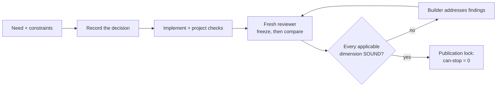
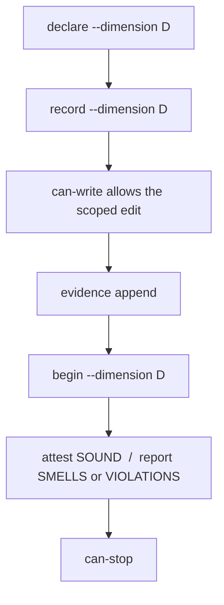
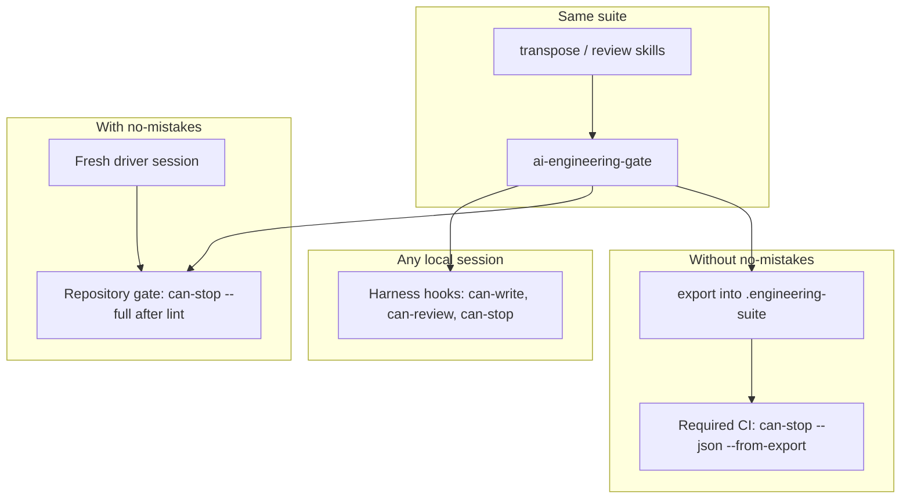

# Skills

Personal agent skills by **Guillaume Mongin** ([@hellraisercenobit](https://github.com/hellraisercenobit)). Licensed under [MIT](./LICENSE); ownership is recorded in [NOTICE](./NOTICE).

The **transpose/review suite** is a protocol for coding agents: record an engineering decision **before** the affected edit, implement it, then have a **fresh** reviewer challenge the result against a shared catalog. The lock on publication is `ai-engineering-gate`, not a generic CI green.

**Start here:** [strategy](#how-the-suite-works) · [CLI workflow](#the-workflow-and-the-cli) · [environments](#how-it-fits-the-environment) · [install](#1-install-the-suite) · [other tools](#also-in-this-repository).

| Dimension | Question | Before implementation | Independent review |
| --- | --- | --- | --- |
| Design patterns | Which architecture fits the forces and the framework? | [transpose-design-patterns](./skills/engineering/transpose-design-patterns/SKILL.md) | [review-design-patterns](./skills/engineering/review-design-patterns/SKILL.md) |
| Modern TS/JS | Which language, types, collections and platform choices fit the behavior? | [transpose-modern-typescript](./skills/engineering/transpose-modern-typescript/SKILL.md) | [review-modern-typescript](./skills/engineering/review-modern-typescript/SKILL.md) |
| Testing / TDD | Which observations and evidence protect the behavior? | [transpose-testing-patterns](./skills/engineering/transpose-testing-patterns/SKILL.md) | [review-testing-patterns](./skills/engineering/review-testing-patterns/SKILL.md) |

### Also in this repository

| Tool | Job | Install |
| --- | --- | --- |
| [agent-instruction-doctor](./docs/engineering/agent-instruction-doctor.md) | Diagnose why an agent ignores a rule, skips a skill or fights a hook: rebuild the effective instructions (AGENTS.md, CLAUDE.md, rules, skills, hooks, settings, subagents, MCP) and apply only the repairs you select. You invoke it with `/agent-instruction-doctor`. | `npx skills add hellraisercenobit/skills --skill agent-instruction-doctor --global` |

It ships in the same Claude Code plugin and needs no companion or gate. It is **outside the suite**: it cannot supply or replace a suite verdict. See [install it alone](#install-agent-instruction-doctor).

## How the suite works

One **builder** decides. One **fresh reviewer** per applicable dimension audits, read-only, without the builder's conversation. They share a [versioned contract (C01-C12)](./contracts/suite-contract.md) and one catalog per dimension. They never average verdicts: a design `SOUND` does not cancel a TypeScript `VIOLATIONS`.



**Transpose** inventories the sites the change actually touches, compares alternatives (including keep and `none`), writes a decision record **before** the first affected edit, then implements and runs the project's checks.

**Review** starts from a [neutral brief](./contracts/suite-contract.md#neutral-brief): original request, scope, constraints, record paths. It freezes its expected choices **before opening the records**, then compares expected / recorded / actual. A finding must survive a steelman of the builder's defense. The reviewer never edits the tree.

A dimension with no applicable site is declared **non-applicable**, with a reason. It is not awarded a synthetic `SOUND`.

Completion is **passing applicable checks and current `SOUND` in every applicable dimension, with no unresolved dispute**. `SOUND` is a complete audit with zero confirmed findings. `SMELLS` and `VIOLATIONS` are work to do. Missing prerequisites are incomplete execution, not a fail of taste.

This is a protocol, not a promise of bug-free code. Reviewers can miss defects. Catalogs can be incomplete. The [smoke fixtures](./tests/README.md) check representative behavior; they do not measure a quality gain over rules alone.

## What this adds to project rules

Project rules stay. The suite adds evidence, independence and expiry around decisions that need judgment.

| With a rule alone | What the suite adds |
| --- | --- |
| "Prefer native APIs" | Inventory, alternatives, recorded invariants, then an independent check that the chosen API is actually supported |
| "Explain the implementation" | A revisioned record written **before** the edit |
| "Review your work" | A fresh context that freezes expectations before reading the author's rationale |
| "The tests pass" | Observed checks **and** a separate judgment on design and oracles |
| "Approved" | A verdict bound to source, catalogs and records. Change any of the three and it expires |

Enforcement is optional until the project commits a marker. Without `.ai-engineering-suite.json`, skills still work; the gate prints nothing and allows. With the marker, `can-stop` is the publication lock. Generic CI success is not a suite verdict.

The gate catches omission, drift and stale evidence. It does not stop a forged index or a write through a tool the hooks do not see. That is the [threat model](./docs/ai-engineering-gate.md#threat-model).

## The workflow and the CLI

Same commands locally, in a delivery driver and in CI. The gate does not spawn reviewers. It stores documents, computes three fingerprints and answers yes or no.



Typical builder session, after the marker exists:

```sh
ai-engineering-gate declare --dimension modern-typescript --stdin < declaration.json
ai-engineering-gate record  --dimension modern-typescript --stdin < record.json
# implement; hooks call can-write for you
ai-engineering-gate evidence append --dimension modern-typescript --stdin < event.json
ai-engineering-gate status --full
```

Typical reviewer session, dispatched from the printed plan, in a **fresh** context:

```sh
ai-engineering-gate begin  --dimension modern-typescript
ai-engineering-gate attest --dimension modern-typescript --stdin < envelope.json   # SOUND only
# or: report --stdin  for SMELLS / VIOLATIONS
```

Publication:

```sh
ai-engineering-gate can-stop           # exit 0 is the lock
ai-engineering-gate can-stop --full    # compact status + dispatch plan, for a repair agent
ai-engineering-gate can-stop --json    # machine surface, for CI
```

| Role | Commands |
| --- | --- |
| Builder | `declare`, `record`, `evidence append`, `dispute` |
| Reviewer | `begin`, then `attest` or `report`; `release` if it stops without filing |
| User only | `arbitrate` (refused from any agent tool call) |
| Gate / hooks | `status`, `can-write`, `can-review`, `can-stop`, `fingerprint` |
| Publication | `export`, then `can-stop --from-export` in CI |

A verdict binds to three content hashes the gate computes and never accepts from a document:

- **source** - declared scope, configuration and the change set (including untracked files)
- **reference** - catalogs, schemas, guides, contract and gate versions
- **decision** - the declaration and every record, with revision numbers

Edit covered code, bump a catalog or revise a record: the old `SOUND` is stale. A second review of the same dimension cannot start while another dimension still has an open finding. Corrections are batched into rounds. The full command list lives on [the gate page](./docs/ai-engineering-gate.md).

From a plugin or this checkout the binary is `node packages/ai-engineering-gate/dist/ai-engineering-gate.mjs`. After `npm i -g @hellraisercenobit/ai-engineering-gate` it is `ai-engineering-gate` on `PATH`.

## How it fits the environment

The protocol does not change. Who **dispatches** the reviewers and who **consumes** `can-stop` does.



| | Local harness | With [no-mistakes](https://kunchenguid.github.io/no-mistakes/) | Direct GitHub PR, no no-mistakes |
| --- | --- | --- | --- |
| Skills and gate | Same | Same, installed for the **same OS user** as the daemon | Same |
| Marker | Needed for enforcement | Needed | Needed; committed |
| Who launches reviewers | Builder session, from `status --full` | Pipeline review agent, from the printed plan | Builder session, same as local |
| What is the lock | Advisory `Stop` hook, easy to bypass | Repository gate **after lint**, `can-stop --full`, trusted from the default branch | Required CI check, `can-stop --json --from-export` |
| Evidence | Gate index under the evidence root | Same index; do not auto-commit the marker or export dir | `export` copies the task into the repo; CI recomputes fingerprints from a clean checkout |
| Arbitration | You type `arbitrate` locally | Driver **parks**; you run `arbitrate` on your machine | Same: human-typed, never an agent |

Pick **one** publication lock. Mixing "hooks said it was fine" with "CI was green" without `can-stop` is how stale `SOUND` ships.

### Local harness

The Claude Code plugin installs the gate plus hooks: `SessionStart` (compact status), `PreToolUse` (`can-write` / `can-review`), `Stop` (compact `can-stop`; briefs stay behind `--full`), and the optional `PostToolUse` / `SubagentStop` (fingerprint refresh and `release`; they never deny). A skills.sh copy and Codex need [the installer](#connect-claude-code-and-codex-hooks). `Stop` is advisory in both harnesses.

### With no-mistakes

no-mistakes does not learn the suite. It runs a repository gate and a review agent that you configure.

1. Install no-mistakes **and** the suite for the same agent user.
2. `no-mistakes init` then `no-mistakes doctor` in the target repo.
3. Merge this project's [`.no-mistakes.yaml`](./.no-mistakes.yaml): gate `engineering-suite` after `lint`, review instructions that dispatch suite reviewers, `ci.revalidate_repairs`, protected marker and export directory.
4. Those fields apply from the **trusted default branch**. Until they land, dispatch by hand from `status --full`.
5. The **driver** is a fresh session: `no-mistakes axi run --intent "..."`. It is not the reviewer. It never answers the suite gate and never writes an arbitration.

| `can-stop` codes | Driver |
| --- | --- |
| `stale-source`, `stale-reference`, `stale-decision`, `missing-review`, `remedies-pending` | `--action fix` (repair agent runs the printed plan) |
| `arbitration-required`, `round-cap-reached`, `unresolved-dispute` | park; you run `arbitrate` locally |
| `missing-declaration`, `missing-reason`, `missing-record`, `missing-evidence`, `non-sound-review`, `review-in-flight` | park; that work is the author's |
| `gate-failure` | park as infrastructure |

Do not start `axi run` from a harness hook: pipeline agents fire those events too.

### Without no-mistakes

Same local hooks and the same dispatcher. For publication, export the task and let CI recompute:

```sh
ai-engineering-gate export
git add .engineering-suite
git commit -m "chore: export suite evidence"
git push -u origin HEAD
gh pr create --base main --fill
gh pr checks --watch
```

`export` refuses when the change set is still dirty relative to HEAD. CI runs `can-stop --json --from-export` from a clean checkout, with the gate bundle CI installed. The check must be **required** on the target branch. It fails if the marker exists on the base ref and not on the head. An empty check list is not a pass.

## How the suite scales

A **dimension** is two companions, one catalog, one contract. Adding a dimension must not add a hook.

- Load only the dimensions the change needs. A local TS idiom is not an architecture review.
- Final reviewers run in parallel on one frozen source state. One correction round, then all applicable reviews again.
- Qualify a new pair on [the smoke page](./tests/README.md) before calling it `qualified`. The [maintainer guide](./docs/skill-suite.md#maintain-and-extend) is the registration checklist.

## Where to read next

| Document | Purpose |
| --- | --- |
| [Shared contract](./contracts/suite-contract.md) | C01-C12, neutral brief, expiry |
| [Gate](./docs/ai-engineering-gate.md) | Commands, marker, fingerprints, hooks, AXI |
| [Suite maintainer guide](./docs/skill-suite.md) | Composition and how to add a dimension |
| [Engineering skill pages](./docs/engineering/README.md) | Per-tool triggers |
| [Glossary](./CONTEXT.md) | Marker, declaration, fingerprint, envelope, round |
| [Smoke validation](./tests/README.md) | D tests in CI, J live fixtures |

## 1. Install the suite

Git, Node.js/npm, a configured coding agent. Node 24 for **this** repository's checks. Skills follow the **target** project's compiler and runtime.

Always install both companions of a dimension from the same revision.

### Project installation with skills.sh

```sh
npx skills add hellraisercenobit/skills \
  --skill transpose-design-patterns review-design-patterns transpose-modern-typescript review-modern-typescript \
  transpose-testing-patterns review-testing-patterns \
  --agent codex claude-code --yes
npx skills list
```

Keep only the agents you use. Add `--global` for a personal install. This installs the six skills, not the named reviewer agents. For a team, commit the installer output (`skills-lock.json` and the project skill files). Pin a tag by passing a local clone path instead of `hellraisercenobit/skills`.

### Claude Code plugin

Installs promoted skills, the three reviewer agents **and** the gate hooks:

```sh
claude plugin marketplace add hellraisercenobit/skills
claude plugin install hellraisercenobit-skills@hellraisercenobit
claude plugin list
```

Restart afterwards. Do not also install the same skills through skills.sh for that harness.

### Install agent-instruction-doctor

It stands alone: no companion, no reviewer agent, no gate.

```sh
npx skills add hellraisercenobit/skills --skill agent-instruction-doctor --agent codex claude-code --global --yes
```

`--global` makes it available in every repository, which suits a tool that audits user and global settings too; drop it for one project. The Claude Code plugin above already includes it. It never starts on its own: type `/agent-instruction-doctor <symptom>`, for example `/agent-instruction-doctor my no-comment rule is ignored`, or run it with no symptom for a general audit. It lists repair candidates (`F01`, `F02`...) and applies only the ones you pick.

### Local development from this repository

```sh
git clone https://github.com/hellraisercenobit/skills.git agent-skills
cd agent-skills
npm ci
npm test
npm run check:contract
npm run link-skills
```

`link-skills` replaces same-named directories under `~/.claude/skills` and `~/.agents/skills`. Back them up first.

### Verify discovery

In a **new** session in the target project:

```text
Without editing files, resolve the six suite skills. List installed paths,
shared contract version and catalogs. Confirm you can start a fresh reviewer
without inheriting this conversation.
```

Expected: six skills, companion references, shared contract **1.1.0**, independent reviewer context. Codex: project `.agents/skills` or `~/.agents/skills`; `/skills` or `$` to select.

### Connect Claude Code and Codex hooks

The plugin already wires hooks. A skills.sh copy and Codex do not. From this checkout:

```sh
npm run install:hooks
npm run install:hooks -- --optional
```

The installer only writes suite entries. Codex uses `preToolUse`, `beforeShellExecution`, `subagentStart`, `stop`. It has no `sessionStart` context injection; the installer says so instead of wiring a no-op.

| Event | Gate command |
| --- | --- |
| `SessionStart` | `status` |
| `PreToolUse` | `can-write` / `can-review` |
| `Stop` | `can-stop` |
| `PostToolUse` | `fingerprint` (optional, never a deny) |
| `SubagentStop` | `release --hook` (optional) |

See [Claude hooks](https://code.claude.com/docs/en/hooks#pretooluse) and [Codex tool coverage](https://learn.chatgpt.com/docs/hooks#tool-coverage).

## 2. Configure the target project

Add this block to `AGENTS.md` (Codex reads it; for Claude Code, load it from `CLAUDE.md`). Keep the rest of the project rules.

```markdown
## Transpose/review suite

- Identify scope/base, actual compiler/runtime targets and applicable dimensions.
  Use transpose-design-patterns for architectural forces,
  transpose-modern-typescript for TS/JS implementation choices, and
  transpose-testing-patterns for test strategy and TDD evidence.
- Resolve both companions and their shared contract. Record and validate decisions
  before the first affected implementation write, through `ai-engineering-gate`.
- Run project checks. Give each applicable review skill to a fresh read-only
  reviewer with no builder history. Use the contract's neutral brief.
- The reviewer freezes expectations before opening records. The builder fixes;
  a new reviewer checks.
- Finish only with passing checks and current SOUND in every applicable dimension.
  A dimension without an applicable site is non-applicable, with a reason.
```

Document the project's real typecheck, test and lint commands. Do not copy this repository's test compiler into an application.

To **enforce** the protocol, commit a marker at the repository root:

```json
{
  "markerVersion": "1.0.0",
  "dimensions": "all",
  "base": "origin/main",
  "exportDirectory": ".engineering-suite"
}
```

Without it the gate is silent. With it, declare every registered dimension (applicable or not) for the task. Evidence lives in the marker's `evidenceRoot` or the default under the user home; `export` copies a task into the repo for CI.

## 3. Run a first task

Give the builder a concrete need:

```text
Modernize src/catalog.ts while preserving its public behavior. Use
transpose-modern-typescript and the project's actual deployment targets.
Consider design-patterns only if architectural forces apply. Record through
the gate, run project checks, dispatch fresh reviews, finish only when
can-stop exits 0.
```

For testing: name the public seam and oracle **before** writing tests; keep RED/GREEN outputs as evidence; a global green is not enough. See the [Vitest qualification guide](./tests/testing-patterns/README.md).

When a named reviewer agent is missing, use a fresh general subagent with the same brief. Reusing the builder conversation is not independence.

## Updates and troubleshooting

### Migrate the design-pattern skill name

`transpose-design-patterns` replaces `transpose-design-pattern`. There is no alias.

```sh
npx skills remove transpose-design-pattern --yes
npx skills list
```

Add `--global` for a personal install. Then reinstall the six companions. For the plugin, update and restart. Historical records stay; obtain fresh reviews against the renamed bundle.

### Update installed companions

```sh
npx skills update transpose-design-patterns review-design-patterns transpose-modern-typescript review-modern-typescript transpose-testing-patterns review-testing-patterns --project --yes
```

Use `--global` for personal installs. Plugin: `claude plugin update hellraisercenobit-skills@hellraisercenobit`. A catalog change expires affected reviews.

| Symptom | Check |
| --- | --- |
| Skill missing | Scope, selected agent, new session |
| Duplicate names | Several installs; keep one revision |
| Missing companion | Reinstall the pair from the same revision |
| Works locally, not in a gate | Same OS user, PATH, worktree, evidence root |
| no-mistakes ignores the suite | Default-branch `.no-mistakes.yaml`, gate after lint, `ai-engineering-gate` on the daemon PATH |
| Code changed after SOUND | Source fingerprint moved; `can-stop` fails until a new round |

## Other engineering tools - outside the suite

- **[agent-instruction-doctor](./skills/engineering/agent-instruction-doctor/SKILL.md)** - Diagnose ignored or conflicting agent instructions, skills, hooks and settings, then apply only the repairs you select. User-invoked. [Install it alone](#install-agent-instruction-doctor).

## Repository layout and releases

| Bucket | Purpose | Promoted |
| --- | --- | --- |
| [`skills/engineering/`](./skills/engineering/) | Daily code work | yes |
| [`skills/productivity/`](./skills/productivity/) | Daily non-code workflows | yes |
| [`skills/misc/`](./skills/misc/) | Rarely used | no |
| [`skills/personal/`](./skills/personal/) | Personal setup | no |
| [`skills/in-progress/`](./skills/in-progress/) | Drafts | no |
| [`skills/deprecated/`](./skills/deprecated/) | Retired | no |

New skills start from [the template](./skills/in-progress/_template/). Suite membership also needs [contract qualification](./docs/skill-suite.md#maintain-and-extend). After a contract change: `npm run sync:contract`, `npm test`, `npm run check:contract`. After a gate change: `npm run check:gate`, `npm run check:axi`, `npm run test:gate`.

Add a changeset for a release-worthy change, targeting `@hellraisercenobit/ai-engineering-gate`. The [release workflow](./.github/workflows/release.yml) versions that package from `main` and copies the version onto the plugin manifests. Do not edit generated changelogs, manifest versions or the gate bundle by hand.
