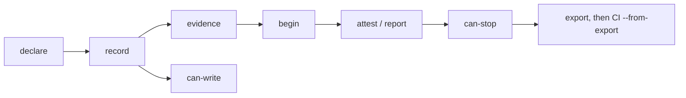

# ai-engineering-gate

Command and enforcement reference. Strategy, workflow diagrams and environment choices (local harness, [no-mistakes](https://kunchenguid.github.io/no-mistakes/), direct PR + CI) live in the [README](../README.md#how-the-suite-works).

One CLI, one JSON surface, three fingerprints. The gate does not judge design, TypeScript or tests: it stores the documents, derives the state, and answers whether a task is complete.

Install it with the Claude Code plugin, with `npm i -g @hellraisercenobit/ai-engineering-gate`, or run it from this checkout:

```sh
node packages/ai-engineering-gate/dist/ai-engineering-gate.mjs --help
```

## Opt-in

The gate is silent and allows everything in a repository that does not carry `.ai-engineering-suite.json` at the root. That marker is the project's opt-in. A typical marker:

```json
{
  "markerVersion": "1.0.0",
  "dimensions": "all",
  "base": "origin/main",
  "exportDirectory": ".engineering-suite"
}
```

`dimensions` may also name a subset of the registry in `contracts/members.json`. Without a registered member the gate fails loud rather than inventing a dimension.

## What it answers

| Command | Question |
| --- | --- |
| `status` | compact state of every registered dimension, plus the next action |
| `declare --dimension D --stdin` | file the applicability decision before any record |
| `record --dimension D --stdin` | file a decision record; a dangling citation is refused |
| `evidence append --dimension D --stdin` | append a journal event, a check output or a snapshot |
| `begin --dimension D` | open a review window and freeze the three fingerprints |
| `attest` / `report --dimension D --stdin` | file a SOUND envelope, or a SMELLS / VIOLATIONS one |
| `dispute` / `arbitrate --dimension D --stdin` | contest a finding; only a human-typed command writes an arbitration |
| `replay --dimension D --record R --scenario S --command C` | the gate runs the red/green pair and stamps both events |
| `can-write --path P` | may this path be edited now |
| `can-review --dimension D` | may a fresh review of this dimension start now |
| `can-stop` | is the task complete; the exit code is the publication lock |
| `export` | copy the task's documents into the marker's export directory |
| `fingerprint` | the three fingerprints, as the gate computes them |

`--json` is the schema-checked machine surface. `--full` discloses reasons, missing evidence and the dispatch plan. `--hook` answers in the harness event's own shape.

Exit codes: `0` allowed or valid, `2` denied by policy, `1` gate or infrastructure failure.



Publication lock is `can-stop` exit 0. With no-mistakes the driver consumes `can-stop --full` after lint. Without it, CI consumes `can-stop --json --from-export`. Local hooks are advisory. See [how it fits the environment](../README.md#how-it-fits-the-environment).

## Fingerprints

A verdict binds to three content hashes the gate computes and never accepts from a document:

- **source** - declared scope, configuration files and the change set (tracked, staged, untracked)
- **reference** - the dimension's catalog, schemas and guides plus the contract and gate versions
- **decision** - the declaration and every record, each with its revision number

A content-neutral rebase leaves a verdict current. A catalog edit, a record revision or a new file in scope expires it.

## Hooks

The plugin ships the three required hooks (`SessionStart`, `PreToolUse`, `Stop`) and the two optional ones (`PostToolUse` eager fingerprint refresh, `SubagentStop` `release --hook`) against this bundle. `SessionStart` and `Stop` inject the **compact** status (`next:` plus `status --full`). The dispatch briefs stay behind an explicit `can-stop --full` / `status --full`, which is what a no-mistakes driver runs. Neither optional hook decides validity. `npm run install:hooks -- --optional` covers a skills.sh install and Codex. Codex has no `sessionStart` context injection; the installer reports that limit instead of wiring a hook that answers into the void.

## Threat model

The gate catches omission, drift and stale evidence. It does not defend against a forged index or a write through a tool the hooks do not see. `can-write` denies harness edits and shell write forms that target the index outside gate commands.

## AXI

The surface is self-assessed against a pinned AXI text in `contracts/axi/`. `npm run check:axi` re-runs the named assertions. There is no AXI runtime dependency, and a new upstream revision requires a re-qualification, never a silent bump.
